First lets define the terms.

## LCA (Lowest Common Ancestor):
Given a pair of nodes , the common ancestor which is farthest from root. See [Wiki!](https://en.wikipedia.org/wiki/Lowest_common_ancestor) for better explanation.
## RMQ (Range Minimum Query): 
Given an array of number , return the index which is minimum between a given pair of indices.

LCA problem can be converted to RMQ problem as following
* Do [Euler Tour!](https://en.wikipedia.org/wiki/Eulerian_path) on the given tree and stores the vertex visisted in an array E. Note that size of this array will be __2n-1__ because every edge has even degree and is visited twice.
* Store level of each vertex during Euler tour in an array L. Note that consecutive entry in this array will differe by +/- 1 [ because the euler path will eithe go down or up and this will only change level either by +1 or -1]. This too will be 2n-1
* Store occurence of first occurence each vertex in E another array R. Size will be n as there are n vertices.

How to find LCA

* First check in array R when these nodes occured during Euler tour traversal, this will be A and B.
* Next you get traversal number, check in array L , the shallow node (the minium level ) going from A to B.
* This will give travesal number , map that in E array. Because if L stores level of that node , E store node number.

Lets see this with an example.

LCA of node n will get converted to RMQ of 2n-1 (L array).

Problem boils down to finding RMQ in L, which can be done in multiple ways.
If LCA problem contains n nodes , RMQ problem contains 2n-1 entries (because of size of array L).
Time complexity = \<f(n) , g(n)> ,where f(n) is preprocessing time and g(n) is lookup time.
So for n nodoes of LCA , RMQ solution will be 2n-1 nodes.

* Using Table lookup \<O(n^2), O(1)>

This is a dynamic programming approach, where we create partial solution and then use them to build further.
For example to generate minimum between [0,1] we find miniumum between [0,0] and [1,1] which we know.
Recursively we keep building this lookup table.
Time and space complexity is O(n^2).

* Using Sparse Table (ST) \<O(n log(n)), O(1)>
This is also a recursive approach but we build a lookup table in powrs of 2 starting from every index.
For example for index 0 we do
0,0 -> 2^0
0,1 -> 2^1
0,3 -> 2^2
For lookup we find maximum block which span from start index to end index.
Another block which span from end_index to anything after start_index but maximum.
That will overlap and we will get over minimum.

* Using Segment Tree \<O(n), O(log n)>
* +- RMQ \<O(n), O(1)> Algorithm for finding RMQ on Restricted array (contains only +- 1)

## +- RMQ method
Divide the array L in blocks and then precompute minimum in each block.
Blocsize is choosen as log (n) /2. This bring time & space complexity to O(n).
Sparse table  whose time complexity is O(n logn) , replace n by log (n)/2 , we get O(n).
For Computing table M,  since array L contains 0,1 and is divided in blocks. There can be 2blocksize possible combination.
To build each of those combination we need a nested loop that would take blocksize2.

Total time = blocksize2 * 2blocksize , which is O(n) [blocksize = log (n) / 2 ] 

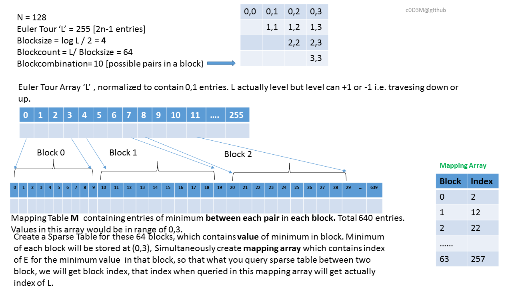
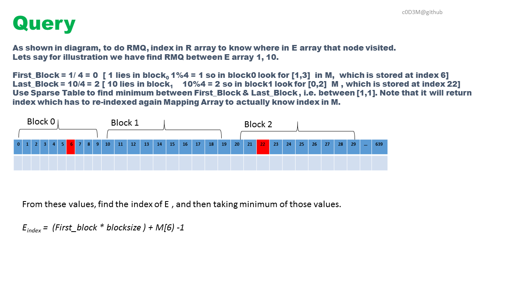

#### RMQ to LCA
RMQ problem can be converted to generalized RMQ problem by first converting it to LCA problem and then can be solved using above way.
We use cartesian tree to convert RMQ to LCA

What is Cartesian Tree
 A tree that can be build from an array which satisfy
* min-Heap or Max Heap property
* an inorder travesal yield the orignal array.

This is how we can convert an array into a cartesian tree.
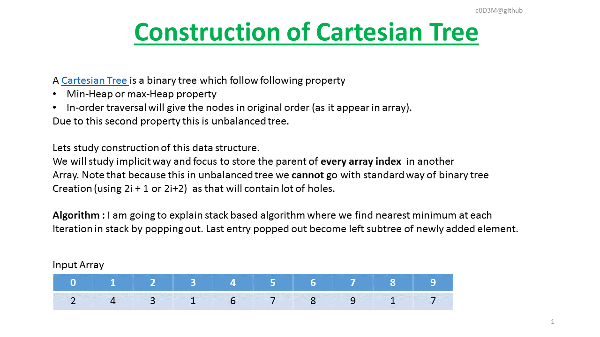
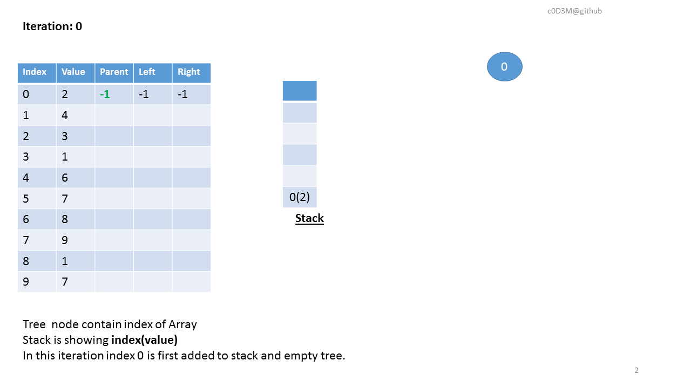
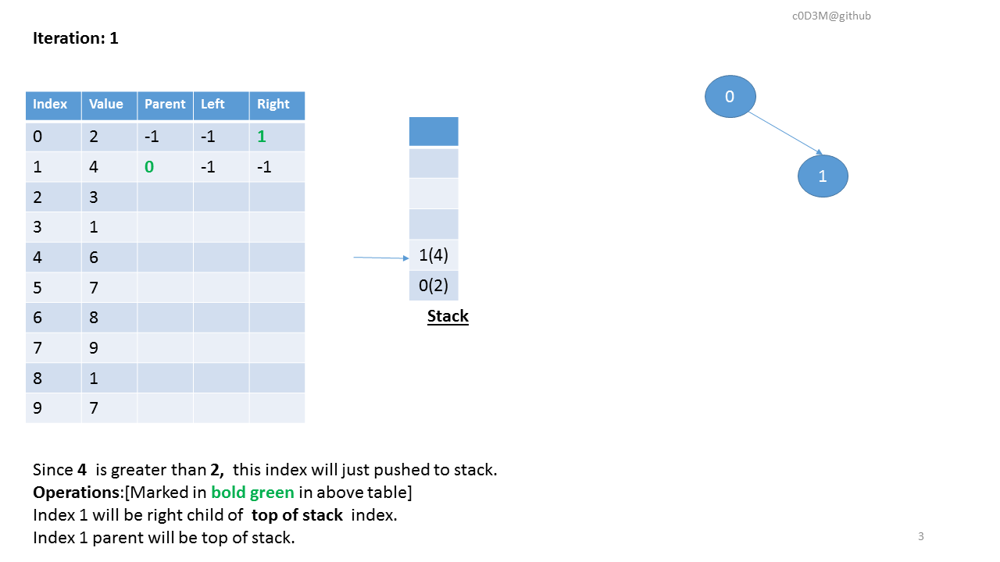
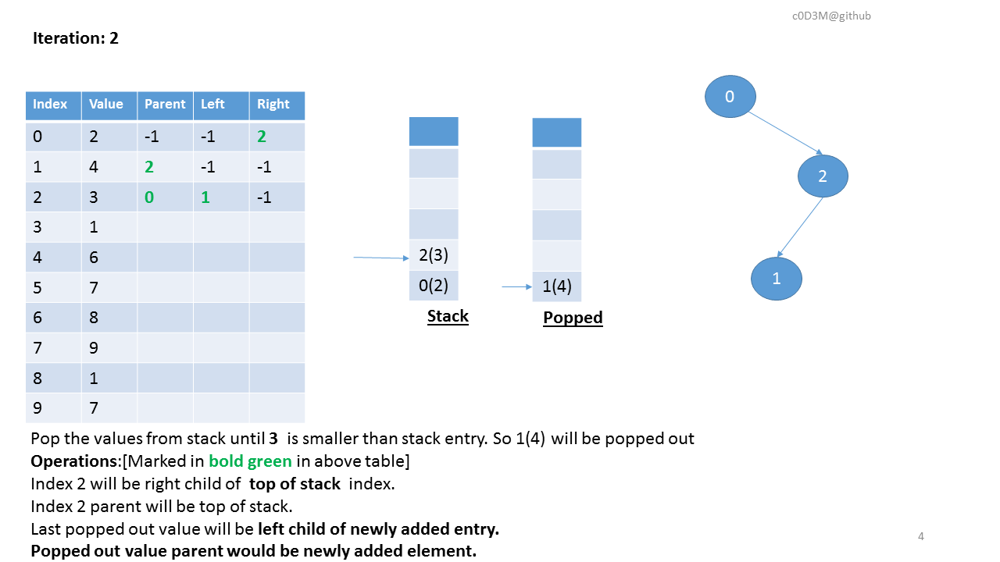
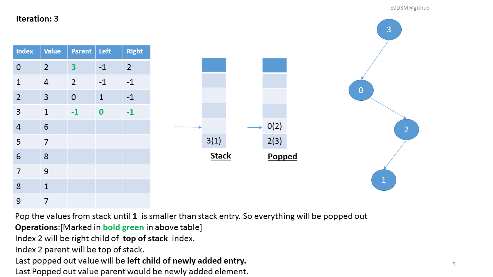
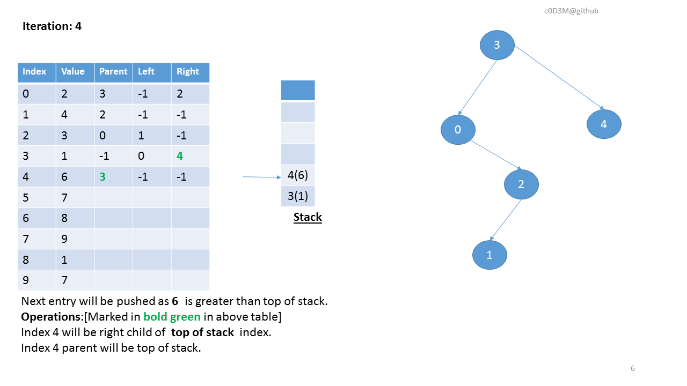
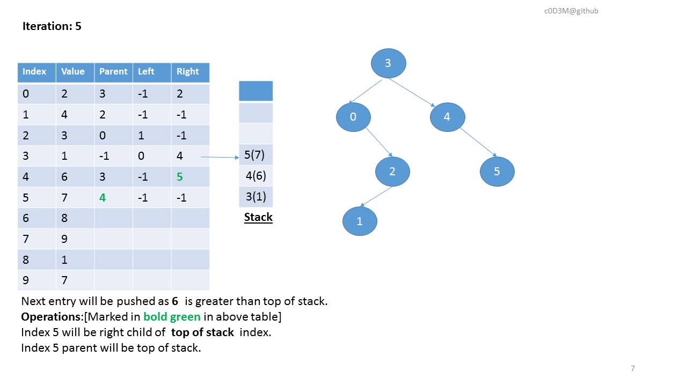
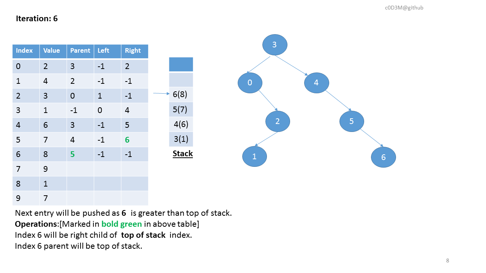
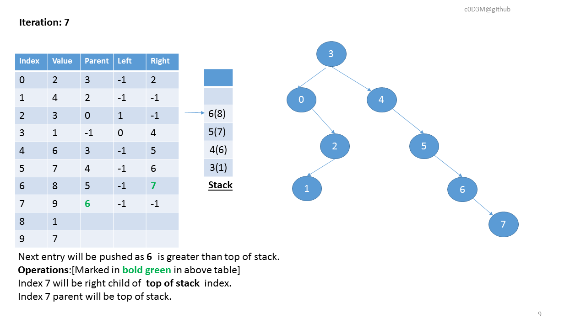
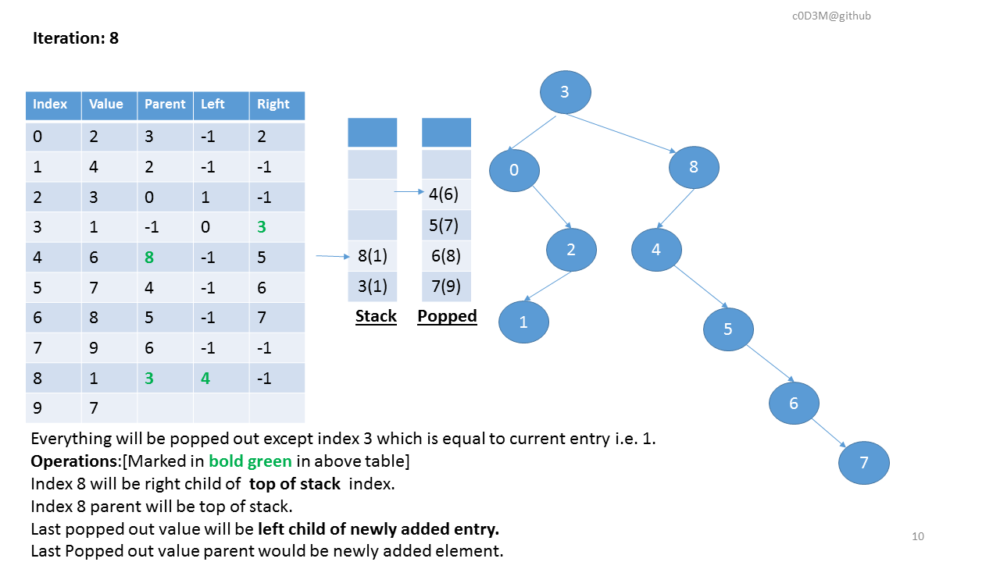
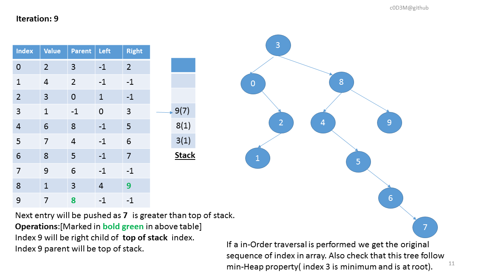

Reference
1. https://www.topcoder.com/community/data-science/data-science-tutorials/range-minimum-query-and-lowest-common-ancestor/
2. 
